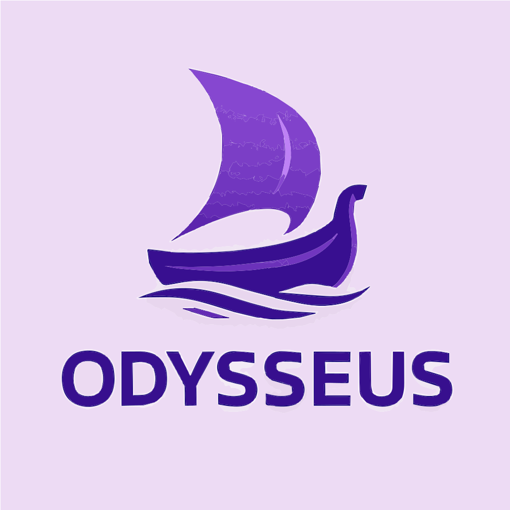

# 🧭 Odysseus - Job Application Tracker

<div align="center">
  
</div>

A modern web application built with **Blazor Server** and **PostgreSQL** to help job seekers track and manage their job applications throughout their career journey. Features a comprehensive dashboard with analytics and visualization capabilities.

## 📋 Table of Contents

- [Features](#-features)
- [Technology Stack](#-technology-stack)
- [Architecture](#-architecture)
- [Getting Started](#-getting-started)
- [Project Structure](#-project-structure)
- [Database Configuration](#-database-configuration)
- [Docker Support](#-docker-support)
- [Development](#-development)
- [Contributing](#-contributing)

## ✨ Features

### 🎯 Core Functionality
- **User Authentication**: Secure registration and login with ASP.NET Identity
- **Job Application Management**: Full CRUD operations for job applications
- **Application Tracking**: Track applications through multiple stages
- **Dashboard Analytics**: View success rates, pending applications, and statistics
- **Responsive Design**: Mobile-friendly interface built with Bootstrap 5

### 📊 Job Application Features
- Company information (name, country, role)
- Application status tracking (Not Applied → Applied → In Progress → Waiting Response → Accepted/Denied)
- Multiple interview phases support
- Sponsorship and relocation requirements
- Personal notes and job posting links
- Application timeline with creation and update timestamps

### 📈 Dashboard & Analytics
- **Comprehensive Statistics**: Total applications, pending, in-progress, and rejected counts
- **Status Overview**: Clear statistics cards showing application status breakdown
- **Application Listing**: Detailed table view of all job applications
- **Real-time Updates**: Live dashboard with dynamic statistics
- **Status Tracking**: Detailed application status monitoring
- **Empty State Guidance**: Helpful onboarding for new users

## 🚀 Technology Stack

- **Framework**: ASP.NET Core 9.0 with Blazor Server
- **Database**: PostgreSQL 16 with Entity Framework Core
- **Database Provider**: Npgsql.EntityFrameworkCore.PostgreSQL
- **Authentication**: ASP.NET Core Identity
- **UI Framework**: Bootstrap 5 with Bootstrap Icons
- **Architecture**: Clean Architecture with SOLID principles
- **Containerization**: Docker Compose with PostgreSQL and app containers
- **Development**: Hot reload, Entity Framework migrations

## 🚀 Getting Started

### Prerequisites

- [.NET 9.0 SDK](https://dotnet.microsoft.com/download/dotnet/9.0)
- [PostgreSQL 16+](https://www.postgresql.org/download/) or [Docker](https://www.docker.com/get-started)
- [Entity Framework Core Tools](https://docs.microsoft.com/en-us/ef/core/cli/dotnet)

### Quick Start with Docker (Recommended)

1. **Clone the repository**
   ```bash
   git clone https://github.com/nusbru/Odysseus.git
   cd Odysseus
   ```

2. **Start with Docker Compose**
   ```bash
   docker-compose up -d
   ```

3. **Access the application**
   - **Web App**: http://localhost:8080
   - **Database**: PostgreSQL on localhost:5432

### Manual Setup (Development)

1. **Clone and setup**
   ```bash
   git clone https://github.com/nusbru/Odysseus.git
   cd Odysseus
   dotnet restore
   ```

2. **Database Setup**
   
   **Option A: Use Docker for PostgreSQL only**
   ```bash
   docker run --name odysseus-postgres -e POSTGRES_DB=odysseus -e POSTGRES_USER=odysseus_user -e POSTGRES_PASSWORD=odysseus_password -p 5432:5432 -d postgres:16-alpine
   ```

   **Option B: Local PostgreSQL**
   - Install PostgreSQL 16+
   - Create database: `odysseus`
   - Create user: `odysseus_user` with password: `odysseus_password`

3. **Apply migrations**
   ```bash
   dotnet tool install --global dotnet-ef
   dotnet ef database update
   ```

4. **Run the application**
   ```bash
   dotnet run
   ```

5. **Access the application**
   - **HTTP**: http://localhost:5232
   - **HTTPS**: https://localhost:7085

### First Steps

1. Register a new account or sign in
2. Navigate to the Dashboard
3. Click "Add New Application" to create your first job application
4. Track your progress and view analytics on the dashboard

## �️ Database Configuration

### PostgreSQL Configuration

The application uses PostgreSQL with the following default configuration:

```json
{
  "ConnectionStrings": {
    "DefaultConnection": "Host=localhost;Database=odysseus;Username=odysseus_user;Password=odysseus_password;Port=5432"
  }
}
```

### Manual Docker Build
```bash
# Build the Docker image from the project directory
docker build -f src/Odysseus/Dockerfile -t odysseus ./src/Odysseus

# Run with external PostgreSQL
docker run -p 8080:80 -e ConnectionStrings__DefaultConnection="Host=host.docker.internal;Database=odysseus;Username=odysseus_user;Password=odysseus_password;Port=5432" odysseus
```

## �🙏 Acknowledgments

- Built with [ASP.NET Core 9.0](https://docs.microsoft.com/en-us/aspnet/core/)
- Database powered by [PostgreSQL](https://www.postgresql.org/)
- UI framework: [Bootstrap 5](https://getbootstrap.com/)
- Icons: [Bootstrap Icons](https://icons.getbootstrap.com/)
- Styling: [Bootstrap 5](https://getbootstrap.com/)
- Containerization: [Docker](https://www.docker.com/)

---

**Track your journey to success!** 🎯 **Happy job hunting!** 🚀
